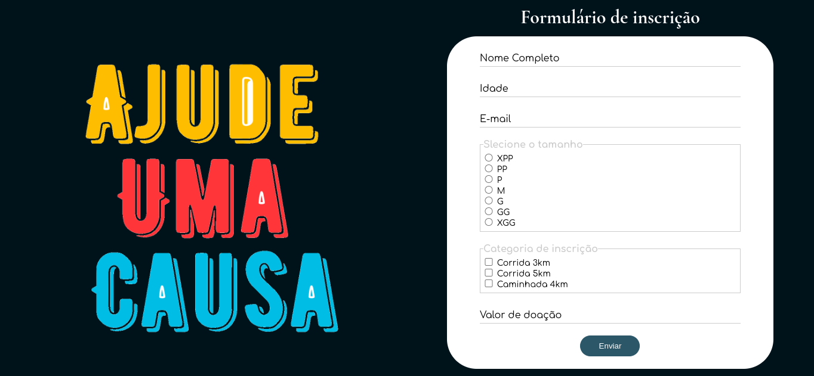

# Exercício 3: Vem Ser Tech - Front End | Ada Tech

## Sobre

 O projeto se trata de um front end básico, utilizando apenas html5 e css vanilla. Essa página foi desenvolvida com intuito de realizar uma atividade de entrega do curso Front end, na Ada Tech, focando em treinamento de criação de formulários e envio dos dados através do método POST.
_______________

### Simulador de backend:
1. Utilizei o json-server de forma local. Para insatalar utilize:
```
npm install json-server
```
2. Para rodar o servidor utilize:
```
npx json-server db.json
```

### Como executar o projeto em desenvolvimento:
1. Clone esse repositório
3. Instale as dependências
2. Acesse a página em seu navegador (pode utilizar extensões como Live Server).

### Imagem do projeto:

<div> 
    
</div>
